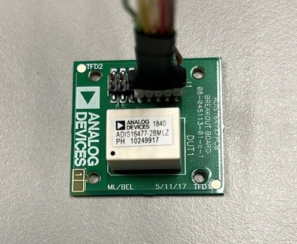

# ADIS-16477 C-driver for STM32 using SPI

## Setup
* NUCLEO board: STM32H743ZIT6
* Sensor: Evalution kit for adis-16477 sensor (Accelerometer, gyroscope and temperature)

## Change the pins for SPI handle, Chip_Select and Hard_Reset pins in header file.

